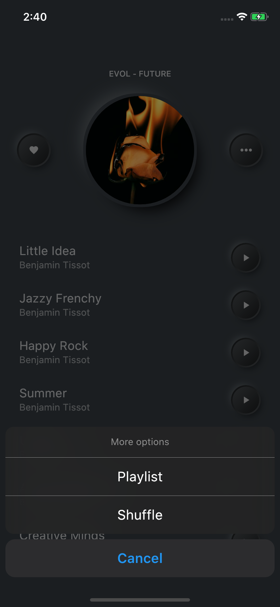
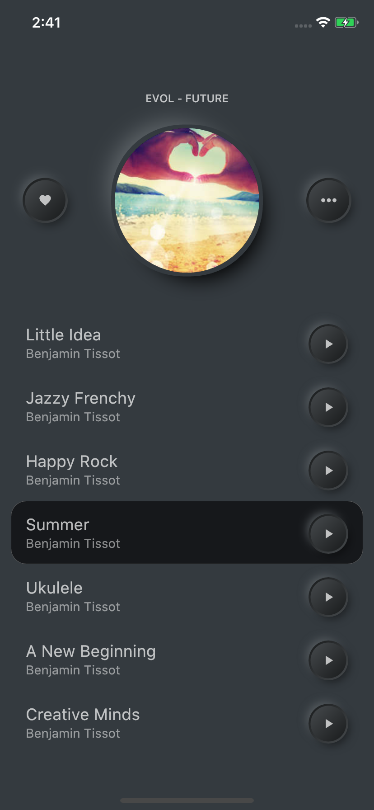

# Simple Music Player
The app was built using Flutter platform.

It's a simple music app built on [Filip Legierski](https://dribbble.com/kedavra "Filip Legierski")'s amazing design for [Riotters](https://dribbble.com/riotters) team.

## Download App
<a href="https://github.com/AhmedAbouelkher/Simple-Music-Player-App/releases/download/tag/1.0.1/Simple.Player.apk"></img></a>

- Original app design: [From Here](https://dribbble.com/shots/9338617-Simple-Music-Player "App Design")
- For more Flutter apps: [From Here](https://github.com/AhmedAbouelkher "profile")

## Design

## Implementation
   
  
